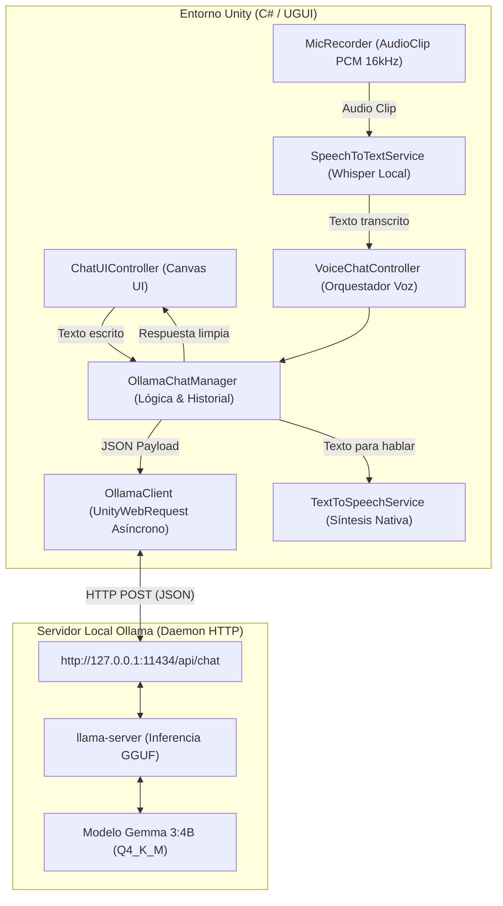
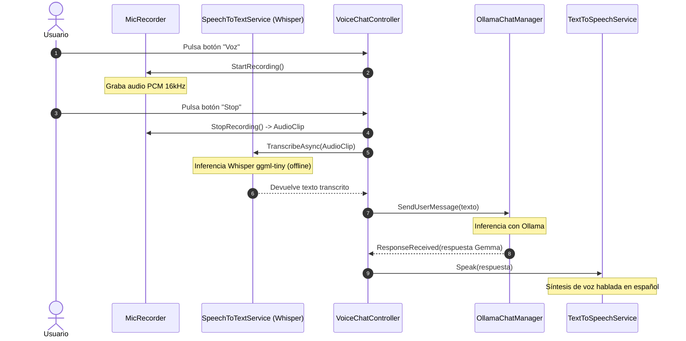
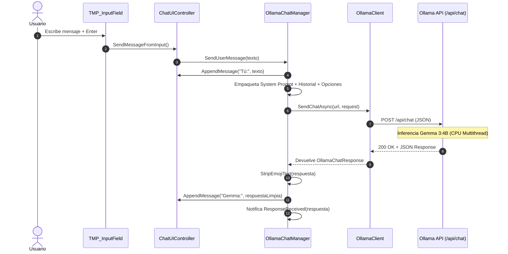

# 🧠 Arquitectura y Funcionamiento Técnico de la Integración de Ollama con Unity

Este documento detalla en profundidad el funcionamiento, diseño de software, protocolos de comunicación, optimizaciones de hardware y flujo de datos de la integración entre **Ollama** (ejecutando **Gemma 3:4B**), **Whisper (STT)**, **TTS Nativo** y **Unity Engine**.

---

## 📑 Tabla de Contenidos
1. [Visión General y Diagrama de Arquitectura](#1-visión-general-y-diagrama-de-arquitectura)
2. [Capa 1: Servidor Local de Ollama y Motor de Inferencia](#2-capa-1-servidor-local-de-ollama-y-motor-de-inferencia)
3. [Capa 2: Capa de Red y Comunicación C# (Core)](#3-capa-2-capa-de-red-y-comunicación-c-core)
4. [Capa 3: Pipeline de Procesamiento de Voz (STT + TTS)](#4-capa-3-pipeline-de-procesamiento-de-voz-stt--tts)
5. [Capa 4: Controlador y Renderizado de Interfaz (UI / UGUI)](#5-capa-4-controlador-y-renderizado-de-interfaz-ui--ugui)
6. [Flujo de Datos Paso a Paso (Diagramas de Secuencia)](#6-flujo-de-datos-paso-a-paso-diagramas-de-secuencia)
7. [Optimizaciones de Rendimiento y Prevención de Errores](#7-optimizaciones-de-rendimiento-y-prevención-de-errores)
8. [Configuración de Parámetros y Buenas Prácticas](#8-configuración-de-parámetros-y-buenas-prácticas)

---

## 1. Visión General y Diagrama de Arquitectura

La arquitectura está construida sobre un modelo desacoplado y asíncrono, donde Unity actúa como **cliente de interfaz y orquestador**, y Ollama actúa como un **microservicio de inferencia local**.



---

## 2. Capa 1: Servidor Local de Ollama y Motor de Inferencia

### 2.1 Daemon y Protocolo REST
Ollama levanta un servicio en segundo plano que escucha peticiones HTTP en el puerto `11434`. 
- **Endpoint Principal:** `POST /api/chat`
- **Endpoint de Estado:** `GET /api/tags`
- **Dirección recomendada:** `http://127.0.0.1:11434` (evita la resolución de nombres DNS/IPv6 `::1` de `localhost` en Windows).

### 2.2 Formato del Payload de Chat (`/api/chat`)
Unity envía un objeto JSON con la siguiente estructura:
```json
{
  "model": "gemma3:4b",
  "messages": [
    {
      "role": "system",
      "content": "Eres un asistente médico experto en salud visual..."
    },
    {
      "role": "user",
      "content": "¿Qué es la catarata?"
    }
  ],
  "stream": false,
  "options": {
    "num_ctx": 2048,
    "num_gpu": 0,
    "num_thread": 8,
    "num_predict": 350,
    "temperature": 0.7
  }
}
```

### 2.3 Parámetros Críticos de Inferencia
- **`stream: false`**: Unity espera la respuesta completa empaquetada en un solo cuerpo HTTP JSON, facilitando la deserialización directa y la lectura continua por TTS.
- **`num_gpu: 0` (`forceCpu = true`)**:
  - *Por qué es vital en Unity:* En entornos gráficos pesados (como Realidad Aumentada con URP y tracking de cámara), la GPU ya está bajo alta demanda de shaders y renderizado. Desactivar la asignación GPU de Ollama previene errores de sobrecarga de memoria VRAM (`CUDA error: shared object initialization failed` / `0xc0000409 buffer overrun`).
- **`num_thread`**: Asignado dinámicamente a `Mathf.Clamp(SystemInfo.processorCount - 1, 2, 8)`. Esto aprovecha al máximo los núcleos lógicos del CPU del dispositivo para acelerar la inferencia en CPU entre 3x y 5x.
- **`num_predict` (350 tokens)**: Delimita la longitud máxima de salida para evitar que el modelo entre en bucles de generación extensos o genere respuestas kilométricas que congelen el flujo de interacción.
- **`num_ctx` (2048 tokens)**: Ventana de contexto compacta que reduce el consumo de memoria RAM y agiliza la evaluación del prompt.

---

## 3. Capa 2: Capa de Red y Comunicación C# (Core)

La capa Core se encuentra en `Assets/OllamaVoiceChat_Module/Scripts/Core/` y se compone de tres scripts fundamentales:

### 3.1 `OllamaModels.cs` (Data Transfer Objects)
Define las clases C# serializables que representan los esquemas de Ollama utilizando `Newtonsoft.Json`:
- `OllamaMessage`: Objeto con `role` (`"system"`, `"user"`, `"assistant"`) y `content`.
- `OllamaChatOptions`: Mapea `num_ctx`, `num_gpu`, `num_thread`, `num_predict`, `temperature` y `top_p` con `NullValueHandling.Ignore`.
- `OllamaChatRequest` y `OllamaChatResponse`: Contenedores completos de la petición y respuesta.

### 3.2 `OllamaClient.cs` (Cliente HTTP Asíncrono)
Maneja la transmisión de red sin bloquear el hilo principal de Unity:
- **`UnityWebRequest` + `TaskCompletionSource`**: Convierte el callback asíncrono de Unity en una `Task<UnityWebRequest>` estándar de C# mediante `SendWebRequestAsync()`.
- **Soporte de Cancelación (`CancellationToken`)**: Si el usuario cancela una consulta o cambia de escena, la petición activa se aborta inmediatamente liberando recursos de red.
- **Timeout Elevado (600s / 10 min)**: Previene que la petición se corte durante el *cold-load* (carga inicial del modelo desde el disco duro a la memoria).

```csharp
// Fragmento clave de OllamaClient.cs
using (var request = new UnityWebRequest(endpoint, "POST"))
{
    byte[] bodyRaw = Encoding.UTF8.GetBytes(jsonBody);
    request.uploadHandler = new UploadHandlerRaw(bodyRaw);
    request.downloadHandler = new DownloadHandlerBuffer();
    request.SetRequestHeader("Content-Type", "application/json");
    request.timeout = timeoutSeconds;

    await SendWebRequestAsync(request, cancellationToken);
    // Validación de errores HTTP y deserialización
}
```

### 3.3 `OllamaChatManager.cs` (Orquestador de Estado y Conversación)
Es el componente central que administra el ciclo de vida del chat:
- **Gestión de Ventana Deslizante de Historial (`maxHistoryTurns = 6`)**: En lugar de enviar un historial infinito que ralentizaría cada turno, solo envía los últimos $N$ mensajes previos combinados con el `systemPrompt`.
- **Inyección de System Prompt**: Inserta automáticamente un mensaje con `role = "system"` al inicio de cada petición para condicionar las respuestas a un formato educativo, conciso y médico.
- **Filtro Sanitizador de Emojis (`StripEmojiText`)**: Emplea una expresión regular (`Regex`) para eliminar caracteres Unicode pictográficos (emojis) de la respuesta de Gemma antes de que lleguen a la UI, evitando los cuadros blancos o excepciones en TextMeshPro.
- **Doble Patrón de Eventos**:
  - `event Action<string>` para suscripción eficiente por código C#.
  - `UnityEvent<string>` para vinculación visual en el Inspector de Unity.

---

## 4. Capa 3: Pipeline de Procesamiento de Voz (STT + TTS)

Ubicada en `Assets/OllamaVoiceChat_Module/Scripts/Voice/`, permite una conversación manos libres 100% offline.



### 4.1 `MicRecorder.cs`
- Inicia la captura del micrófono predeterminado con `Microphone.Start(null, false, maxDuration, 16000)`.
- El muestreo a **16.000 Hz (16 kHz Mono)** es el estándar requerido por la arquitectura de redes neuronales de Whisper, optimizando el tamaño del búfer.
- Realiza un recorte inteligente de silencios finales (`TrimSilence`) para no procesar audio vacío.

### 4.2 `SpeechToTextService.cs` (Whisper Local)
- Utiliza la librería `Whisper.unity` ejecutada directamente en el procesador del cliente.
- Carga el modelo ultraligero `Assets/StreamingAssets/whisper/ggml-tiny.bin` (~75 MB).
- Configura el idioma en español (`language = "es"`).
- Ejecuta la transcripción en un hilo secundario mediante `Task.Run` para no congelar los fotogramas del juego.

### 4.3 `TextToSpeechService.cs` (Síntesis de Voz)
- **Multiplataforma:**
  - En **Windows**: Utiliza la API nativa `System.Speech.Synthesis.SpeechSynthesizer` configurada con voces en español de Windows.
  - En **Android**: Se comunica con la clase nativa `android.speech.tts.TextToSpeech` mediante Java Native Interface (`AndroidJavaObject`).
- **Control de Colisiones:** Se cancela automáticamente si el usuario presiona el botón de micrófono para que el micrófono no grabe la voz del propio sistema.

### 4.4 `VoiceChatController.cs`
- Controla los estados visuales del botón de voz:
  - **Azul (`Voz`)**: Listo para escuchar.
  - **Rojo (`Stop`)**: Grabando audio del micrófono con efecto de pulso animado.
  - **Naranja (`...`)**: Transcribiendo audio con Whisper.

---

## 5. Capa 4: Controlador y Renderizado de Interfaz (UI / UGUI)

Ubicada en `Assets/OllamaVoiceChat_Module/Scripts/UI/` y `Editor/`.

### 5.1 `ChatUIController.cs`
- **Ubicación en Jerarquía:** Se encuentra en el GameObject raíz `Ollama_Chat_Canvas` (no en el panel hijo). Esto garantiza que cuando el usuario cierre el panel (`Ollama_Chat_Panel.SetActive(false)`), el script siga vivo y los botones sigan escuchando clics.
- **Scroll Inteligente y Robusto:**
  - Emplea `Canvas.ForceUpdateCanvases()` y `LayoutRebuilder.ForceRebuildLayoutImmediate` al final del fotograma (`WaitForEndOfFrame`) para garantizar que la caja de límites (`AABB`) de la malla de UI sea válida antes del renderizado de la cámara en URP.
  - Previene advertencias de `Invalid worldAABB` e `IsFinite(distanceAlongView)`.

### 5.2 `OllamaChatUIBuilder.cs` (Generador 1-Click)
- Accesible desde el menú superior de Unity: **`Ollama > Create Chat UI Canvas (with Voice)`**.
- Construye la jerarquía completa en la escena actual con diseño adaptado a móviles (Canvas 1080×1920 portrait).
- Configura automáticamente `CanvasScaler`, `ScrollRect`, `VerticalLayoutGroup`, `TMP_InputField`, botones y referencias en un solo clic.

---

## 6. Flujo de Datos Paso a Paso (Diagramas de Secuencia)

### Flujo Completo de Entrada por Texto:


---

## 7. Optimizaciones de Rendimiento y Prevención de Errores

| Problema Identificado | Causa Raíz | Solución Implementada |
| :--- | :--- | :--- |
| **CUDA Error / Overrun (0xc0000409)** | Colisión de memoria VRAM entre el renderizador de Unity y Ollama GPU. | `forceCpu = true` (`num_gpu = 0`). Inferencia 100% aislada en CPU. |
| **Peticiones Lentas en CPU** | Ollama usando 1 o 2 hilos por defecto. | `num_thread = SystemInfo.processorCount - 1` en las opciones de chat. |
| **Respuestas que nunca terminan** | Preguntas abiertas generando salidas de >1000 tokens en Gemma. | `num_predict = 350` + `System Prompt` de síntesis médica concisa. |
| **Error `Request timeout`** | Carga inicial del modelo (3.5 GB) desde disco superando el límite. | `timeoutSeconds = 600` (10 minutos) y conexión directa `127.0.0.1`. |
| **Recuadros blancos en texto** | TextMeshPro no incluye glifos para emojis Unicode. | Filtro `StripEmojiText()` en C# y cambio de iconos a etiquetas de texto limpias. |
| **Botón Chat Bot inerte al cerrar** | Script UI controller montado sobre el panel desactivado. | `ChatUIController` movido al Canvas raíz permanente. |
| **`Invalid worldAABB` en URP** | RectTransforms con escala 0 o recálculos cíclicos de ScrollView. | `VerticalLayoutGroup` estructurado + `LayoutRebuilder.ForceRebuildLayoutImmediate`. |

---

## 8. Configuración de Parámetros y Buenas Prácticas

### 8.1 Inspector de `OllamaChatManager`
- **`Base Url`**: `http://127.0.0.1:11434`
- **`Model Name`**: `gemma3:4b`
- **`Timeout Seconds`**: `600`
- **`System Prompt`**: Mensaje guía personalizado según la especialidad de la escena AR.
- **`Max Predict Tokens`**: `350` (ideal para respuestas rápidas de 2-3 párrafos).
- **`Max History Turns`**: `6` (mantiene memoria contextual sin sobrecargar).
- **`Force Cpu`**: `True` (garantiza estabilidad absoluta en cualquier hardware con GPU dedicada compartida).
- **`Strip Emojis`**: `True` (garantiza renderizado impecable en fuentes TextMeshPro).

### 8.2 Iniciar Ollama antes de la Aplicación
Asegúrate de que Ollama esté en ejecución en tu máquina:
```bash
ollama serve
```
Y verifica que el modelo esté descargado:
```bash
ollama list
# Si no está instalado:
ollama pull gemma3:4b
```
